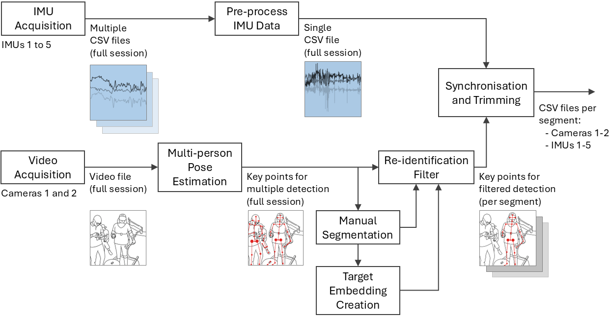
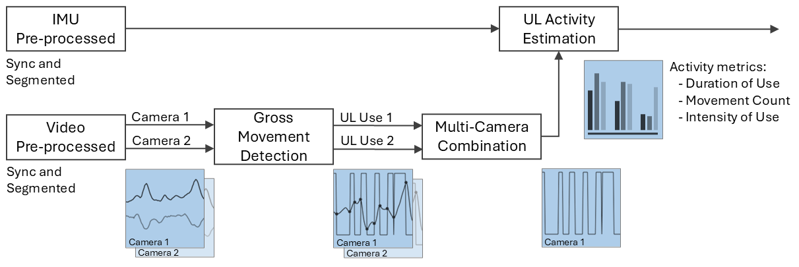

# RehabTrack Workflow

**RehabTrack Workflow** is a modular, open-source pipeline for processing, analysing, and visualising upper-limb physiotherapy movements using **hybrid video–IMU data**.  
Each stage in the workflow is contained in a separate repository, allowing for flexibility and adaptation to different datasets or clinical protocols.

---

## 🧭 Workflow Overview

### 🔧 Pre-processing Stage

This stage prepares the data by merging, annotating, and synchronising IMU and video inputs.



---

### 📊 Processing Stage

This stage detects arm use and estimates activity metrics from synchronised and segmented data.



---

## 📁 Recommended Raw Data Structure

To ensure compatibility across all modules in this workflow, we suggest organising raw data as follows:

```
Data/
└── Raw/
    ├── P01/
    │   ├── Session1_[date]/
    │   │   ├── Video/
    │   │   │   └── VR/ (or CT/, or ARAT_VR/)
    │   │   │       ├── Camera1/
    │   │   │       │   └── *.mkv
    │   │   │       └── Camera2/
    │   │   └── WMORE/
    │   │       ├── Logger1/
    │   │       │   └── *.csv
    │   │       ├── Logger2/
    │   │       ├── Logger3/
    │   │       ├── Logger4/
    │   │       └── Logger5/
    │   ├── Session2_[date]/
    │   └── Session3_[date]/
    └── P02/
        └── ...
```

⚠️ **Note 1:** `VR`, `CT`, and `ARAT_VR` are just examples of session types. You may name session folders however you prefer—just make sure the paths in your code reflect your folder names.

⚠️ **Note 2:** `[date]` in session folder names should follow the format `YYYYMMDD` (e.g., `Session1_20250807`), unless you change the code to reflect another format.

## 📦 Modules Overview

### 🔹 IMU Data Processing
Preprocesses raw IMU logger data recorded using the **[WMORE](https://github.com/NeuroRehack/WMORE)** device—an open-source, wearable IMU developed for rehabilitation research.  
This module merges, cleans, and synchronises multiple logger files, producing **time-aligned datasets** ready for analysis.

📍 Must be run before `DataSynchronization`.

→ [Go to repo](https://github.com/lrlcardoso/IMU_Data_Processing)

---

### 🔹 Video Data Processing
Preprocesses video recordings to:
- Extract **pose and re-ID features** from all individuals
- Isolate and track the **target person**
- Annotate and save cleaned pose data  

📍 Must be run before `DataSynchronization`.

→ [Go to repo](https://github.com/lrlcardoso/VideoDataProcessing)

---

### 🔹 Data Synchronization
Aligns wrist acceleration signals from IMU loggers and video-based markers using **cross-correlation**.  
Outputs a synchronised dataset for downstream movement analysis.

📍 Depends on the outputs of both `IMU Data Processing` and `Video Data Processing`.

→ [Go to repo](https://github.com/lrlcardoso/DataSynchronization)

---

### 🔹 Gross Movement Detector
Detects **gross arm movements** from video-based pose data and synchronised timestamps.  
Generates **binary use signals** for each limb and session.

📍 Depends on `DataSynchronization` output.

→ [Go to repo](https://github.com/lrlcardoso/GrossMovDetector)

---

### 🔹 Upper Limb Activity Estimator
Estimates upper limb activity by computing:
- **Duration of Use**
- **Movement Count**
- **Intensity of Use**  

Integrates use signals and IMU-based metrics into a summary for each session and participant.

📍 Depends on `DataSynchronization` and `GrossMovDetector`.

→ [Go to repo](https://github.com/lrlcardoso/ULActivityEstimator)

---

### 🖥️ Video–IMU Player (Optional)
Interactive GUI for **visual inspection and validation** of the synchronised video and IMU signals.  
Useful for reviewing movement patterns and signal quality in rehabilitation data.

→ [Go to repo](https://github.com/lrlcardoso/Video-IMU_Viewer)

---

## 📝 Citation

If you use this workflow or any of its modules in your research, please cite:

```
Cardoso, L. R. L. (2025). RehabTrack_Workflow: A Modular Video–IMU Framework for Analysing Upper-Limb Physiotherapy Data. GitHub. https://doi.org/XXXX/zenodo.XXXXX
```

---

## 🛠 License

- Code: [MIT License](LICENSE)
- Documentation: [CC BY 4.0](LICENSE-docs)

---

## 🤝 Acknowledgments

This workflow builds upon several open-source tools and libraries, including:

- [WMORE](https://github.com/NeuroRehack/WMORE)
- [YOLO-Pose](https://github.com/itsyb/YOLOv7-Pose)  
- [TorchReID](https://github.com/KaiyangZhou/deep-person-reid)  
- OpenCV
